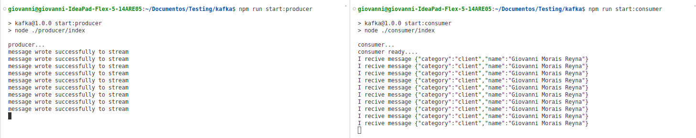

# Kafka with NodeJS
Basic example of kafka producer and consumer connection with nodeJS
## Requerimientos
* Docker
* Node 

# Despliegue

Paso 1: Ejecutar en la terminal el comando que se encuentra en 'scripts/create-topic.sh'.
```
docker exec -it kafka /opt/bitnami/kafka/bin/kafka-topics.sh \
    --create \
    --bootstrap-server localhost:9092 \
    --replication-factor 1 \
    --partitions 1 \
    --topic test
```
Paso 2: luego instalar las dependencias.

```
npm i or npm i install
```
## Mensajeria
Levantar en dos terminarles diferentes el producer y consumer:

### Producer
```
npm run start:producer
```
### Consumer
```
npm run start:consumer
```

Al final el producer estara enviando cada 3 segundos un mensaje y el consumer estara recepcionandolo

